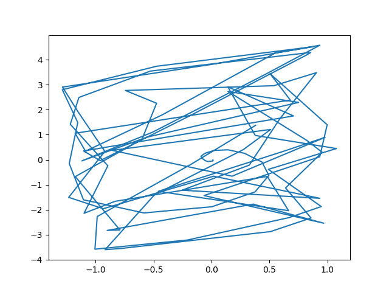
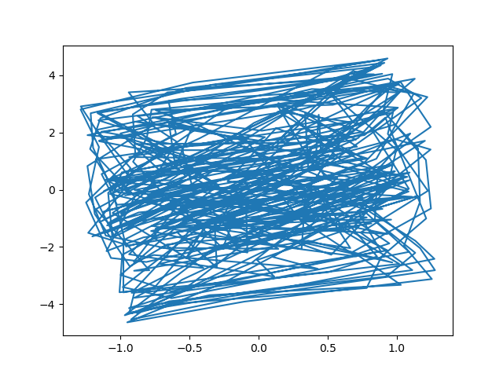
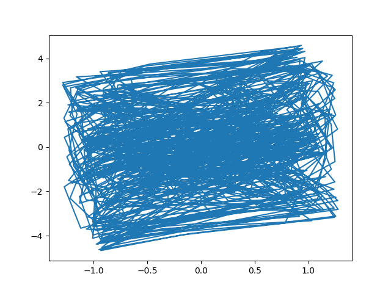
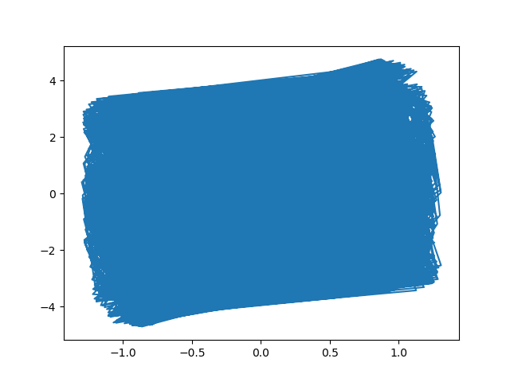

# The project: Cryptography based on delayed chaotic neural networks

## Description:

The project allows to encrypt and decrypt text file by Cryptography based on delayed chaotic neural networks.<br/>
The secrete key of this cryptosystem is (g1, g2, a1, a2, T12, T21, k1, k2, and number of transient iterations N0) must be kept secrete.<br/>
![secrete key] (./key_secrete.png)
<br/><br/>
The trajectory of state variables x1(t), x2(t) as below:<br/>
Iterate 100 times<br/>

<br/>
Iterate 500 times<br/>

<br/>
Iterate 1000 times<br/>

<br/>
Iterate 10000 times<br/>


## Requirement:

Python language with version 3.x<br/>
Then setup environment:<br/>
``` pip install numpy ```
``` pip install matplotlib ```

## Usage:

From terminal type following command line to run:

```  python3 main.py --type type-crypt --file path/to/filename/to/crypt  ```

1. Change "type-crypt" to "enc" if you want to encrypt file, else "dec" to decrypt file.
2. Change "path/to/filename/to/crypt" to file name you want to do crypt

## Copyright by Team 8
